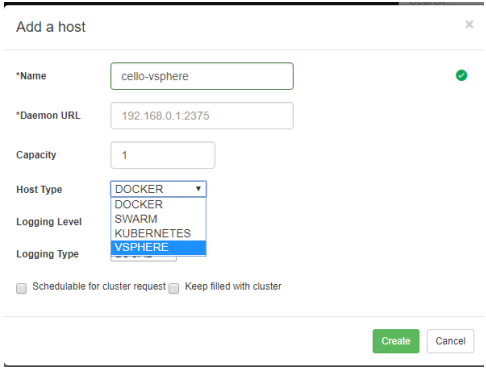
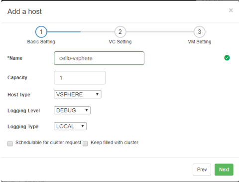
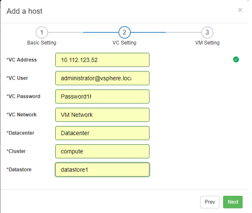
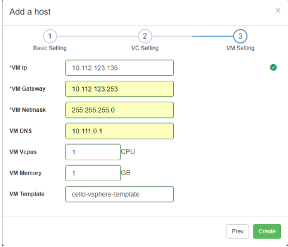
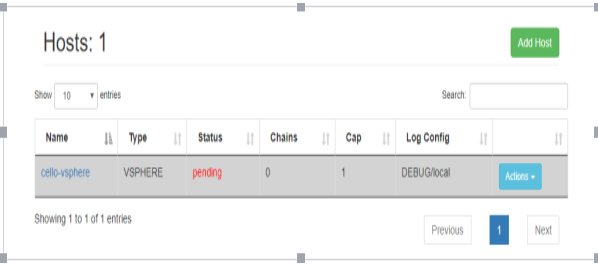
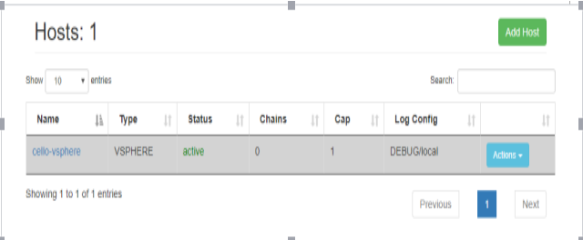

# vSphere type host creation guide

## Prerequisites

- Make sure time is in sync on all esxi hosts in the cluster will be used by Cello otherwise deployment may fail due to certificate expiry check.
- Cello vSphere agent is tested on vSphere deployments with vCenter, single node vSphere without vCenter is not supported.
- Deployment requires DHCP server in the VM network.(If you create VM that use VM network and it can get IP automatically which mean it has a DHCP server)
- vCenter user with following minimal set of privileges is required.
  - Datastore &gt; Allocate space
  - Datastore &gt; Low level file Operations
  - Folder &gt; Create Folder
  - Folder &gt; Delete Folder
  - Network &gt; Assign network
  - Resource &gt; Assign virtual machine to resource pool
  - Virtual machine &gt; Configuration &gt; Add new disk
  - Virtual Machine &gt; Configuration &gt; Add existing disk
  - Virtual Machine &gt; Configuration &gt; Add or remove device
  - Virtual Machine &gt; Configuration &gt; Change CPU count
  - Virtual Machine &gt; Configuration &gt; Change resource
  - Virtual Machine &gt; Configuration &gt; Memory
  - Virtual Machine &gt; Configuration &gt; Modify device settings
  - Virtual Machine &gt; Configuration &gt; Remove disk
  - Virtual Machine &gt; Configuration &gt; Rename
  - Virtual Machine &gt; Configuration &gt; Settings
  - Virtual machine &gt; Configuration &gt; Advanced
  - Virtual Machine &gt; Interaction &gt; Power off
  - Virtual Machine &gt; Interaction &gt; Power on
  - Virtual Machine &gt; Inventory &gt; Create from existing
  - Virtual Machine &gt; Inventory &gt; Create new
  - Virtual Machine &gt; Inventory &gt; Remove
  - Virtual Machine &gt; Provisioning &gt; Clone virtual machine
  - Virtual Machine &gt; Provisioning &gt; Customize
  - Virtual Machine &gt; Provisioning &gt; Read customization specifications
  - vApp &gt; ImportProfile-driven
  - storage -&gt; Profile-driven storage view

## Deployment

**Note** :

The vSphere agent is tested on vCenter 6.0 and vCenter 6.5

### Upload VM image to be used to vSphere:

Upload the template OS OVA to vCenter before create vSphere type host in Cello. The work nodes that run the fabric workloads will be cloned from this VM template.

#### Upload using vSphere Client.

1. Login to vSphere Client.
2. Right-Click on ESX host on which you want to deploy template.
3. Select Deploy OVF template.
4. Copy and paste URL for [OVA for Cello](https://drive.google.com/file/d/1VN4FDlgd0Q7tqBtGNBN5trP7upaswUWS/view?usp=sharing)
5. Please deploy the ova on the same cluster which will be planned to be used by cello later
6. **Check the name of the VM created** , this will be used to create vSphere type host in Cello later. (Should default to PhotonOSTemplate.ova)

This OVA is based on Photon OS(v2.0)

**NOTE: DO NOT POWER ON THE IMPORTED VM.**

If you do power it on, future clones of this VM will end up [getting the same IP as the imported VM](https://github.com/vmware/photon/wiki/Frequently-Asked-Questions#q-why-do-all-of-my-cloned-photon-os-instances-have-the-same-ip-address-when-using-dhcp). To work around this run the following command before powering the VM off.

echo -n &gt; /etc/machine-id

## Add vSphere type host

Login to Cello and navigate to the Hosts-&gt;Add Host

In the &quot;Add a host&quot; page select &quot;Host Type&quot; as VSPHERE

 

Give a name of the vSphere host like &quot;cello-vsphere&quot;, you can specify a capacity number, this number can be configured later. Click &quot;Next&quot;

 

In the VC address field input your VC IP address, if your VC use some port other than 443, you should add the port eg. 10.112.125.53:8443

In the VC user field input a username with the privileges as described in Prerequisites.

In the VC network field enter the network name.

In the Datacenter field enter the datacenter name.

In the Cluster field enter the cluster name that will be used for Cello, this cluster need to belong to the datacenter entered in the Datacenter field.

In the datastore field, enter a datastore that all the esxi hosts in the cluster can be reachable.

 

In the VM IP field enter a static IP address that belong to the VM network.

In the VM Gateway filed enter the VM network gateway.

In the VM Netmask field enter the network mask for the VM network.

In the VM DNS filed enter the DNS for the VM network.

In the VM template field enter the template name (If you don&#39;t change the name it will be PhotonOSTemplate.ova by default)

 

Click Create. You will see the follow page.

. 

This means that the vSphere agent is trying to create a new work node. This will take several minutes which is depend on your esxi host&#39;s resource and network speed. After the node created it will automatically download the farbic 1.0 images to the work node. When everything is ready the new host will be in active state.

 
